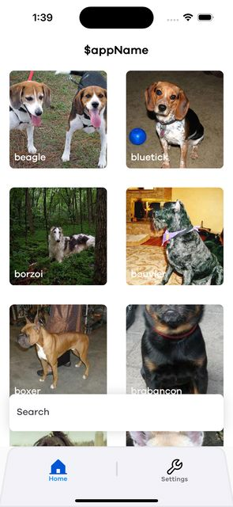
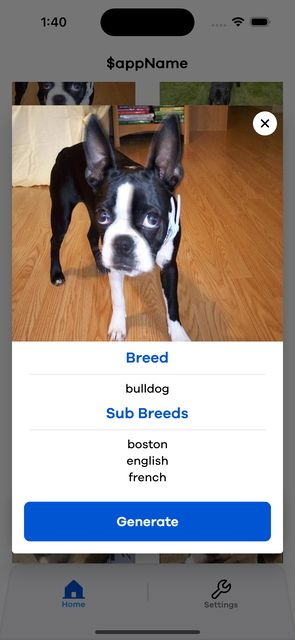
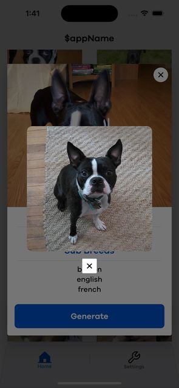
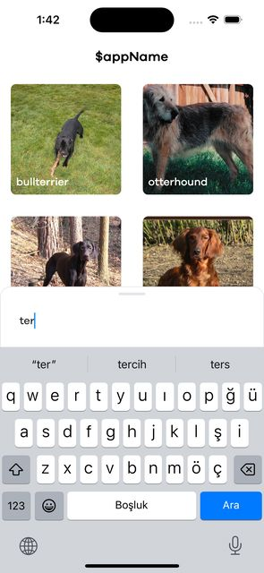

#DogApp

Dog App is a mobile application developed using Flutter. This app presents a platform for listing various dog breeds, allowing users to explore and gain information about different breeds.


## App Screen Shots

 

 


  
## Features

- Listing of dog breeds
- Search functionality to find specific dog breeds
- Displaying detailed information about each breed
- Fetching random dog images

  
## Technologies Used

**State Management:** BLoC 

**Routing:** AutoRoute

**Assets Management:** Flutter Gen

**Network Requests Manager:** Dio

**Architecture Pattern:** MVVM (Model-View-ViewModel)

## Installation

1. Clone this project:

```bash
git clone https://github.com/Mehmettmolla/dog_app.git
```
2. Navigate to the project directory:
```bash
cd dog_app
```
3.Install the required dependencies:
```bash
flutter pub get
```
4.Run the application:
```bash
flutter run
```

## Contributing
1. Fork this repository and create a local copy.
2. Create a new feature branch:
```bash
git checkout -b new-feature
```
3.Commit your changes:
```bash
git checkout -b new-feature
```
4.Push your branch:
```bash
git push origin new-feature
```
Open a Pull Request

## License
This project is licensed under the MIT License. See the LICENSE file for more information.
